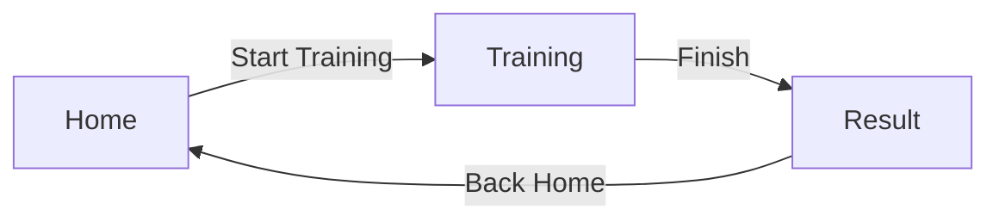

# RopeSkill MVP UI Wireframes

อัปเดตล่าสุด: 22 กรกฎาคม 2026

เอกสารนี้เป็น wireframe ระดับโครงสร้าง ยังไม่ใช่งานออกแบบภาพจริง

## Navigation Flow



## Home Screen

องค์ประกอบขั้นต่ำ:

- App name: RopeSkill
- ข้อความอธิบายสั้น
- ปุ่ม `Start Training`
- ลิงก์หรือพื้นที่ `Training History` เพิ่มเมื่อ local storage พร้อม

```text
┌─────────────────────────────┐
│ RopeSkill                   │
│ ฝึก Basic Bounce ด้วยกล้อง │
│                             │
│      [ Start Training ]     │
│                             │
│ Training History (ภายหลัง) │
└─────────────────────────────┘
```

## Training Screen

องค์ประกอบขั้นต่ำ:

- Camera preview เต็มพื้นที่หลัก
- Pose overlay อยู่ในพิกัดเดียวกับ preview
- Jump Counter อ่านง่าย
- Workout Timer
- สถานะ เช่น `Ready`, `Tracking`, `Body not visible`
- ปุ่ม `Pause` และ `Finish`

```text
┌─────────────────────────────┐
│ Jumps: 24       00:01:12   │
│ Status: Tracking            │
│                             │
│      Camera Preview         │
│       + Pose Overlay        │
│                             │
│    [ Pause ]  [ Finish ]    │
└─────────────────────────────┘
```

## Result Screen

องค์ประกอบขั้นต่ำ:

- จำนวนครั้ง
- ระยะเวลาฝึก
- วันที่และเวลา Session
- ปุ่ม `Back Home`
- ปุ่ม `Train Again` เป็นตัวเลือกหลัง flow หลักผ่านการทดสอบ

```text
┌─────────────────────────────┐
│ Session Complete            │
│                             │
│ Jumps          24           │
│ Duration        1:12        │
│                             │
│       [ Back Home ]         │
│       [ Train Again ]       │
└─────────────────────────────┘
```

## UI States ที่ต้องรองรับ

| State | สิ่งที่ผู้ใช้ควรเห็น |
|---|---|
| Camera permission required | เหตุผลที่ต้องใช้กล้องและปุ่มขอ permission |
| Permission denied | วิธีเปิด permission ใน Settings หรือกลับ Home |
| Camera starting | Loading indicator แบบไม่บังข้อมูลสำคัญ |
| Body not visible | ข้อความให้ถอย/ขยับจนเห็นร่างกาย |
| Tracking | Counter, timer และสถานะที่ชัดเจน |
| Paused | Preview/analysis หยุดตามการออกแบบและมีปุ่ม Resume |
| Error | ข้อความที่เข้าใจได้และปุ่ม Retry/Back |

## Accessibility Notes

- ห้ามใช้สีเพียงอย่างเดียวเพื่อสื่อสถานะ
- ปุ่มต้องมีข้อความหรือ content description ที่ชัดเจน
- Counter และ Timer ต้องมี contrast สูงและอ่านได้บนภาพกล้อง
- ขนาด touch target ควรเป็นไปตามแนวทาง Material 3
